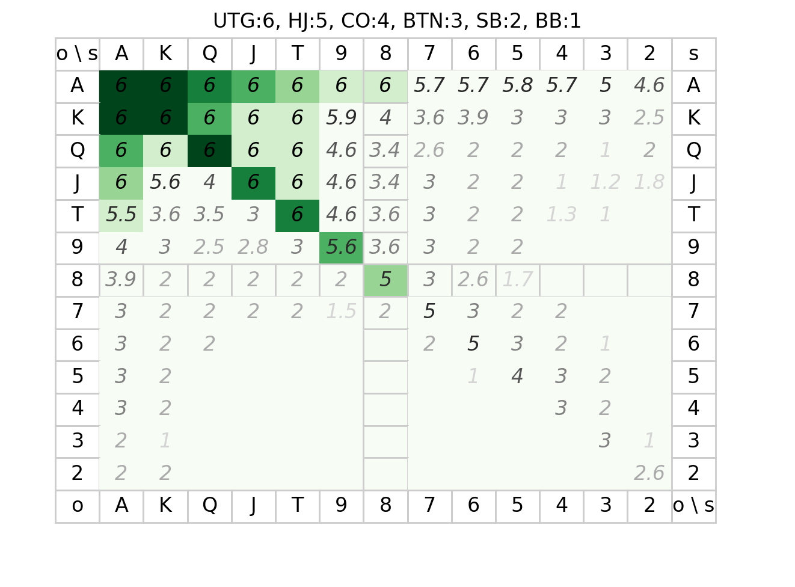
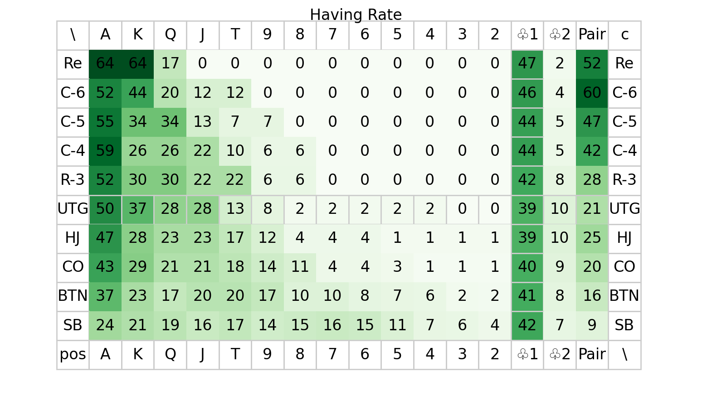
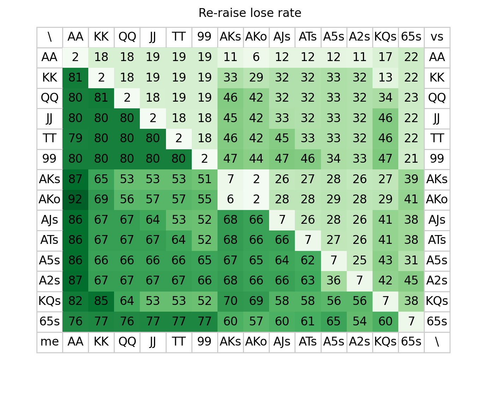

# ハンドレンジ

|自BB \ 死 + 以降の弱|0人|1人|2人|3人|4人|5人|
|:-:|:-|:-|:-|:-|:-|:-|
|50|1|1.5|2|2.5|3|3.5|
|40|0.5|1|1.5|2|2.5|3|
|30|0|0.5|1|1.5|2|2.5|
|20|-0.5|0|0.5|1|1.5|2|
|10|-1|-0.5|0|0.5|1|1.5|

- *-コール/リレイズする: 相手が同じかちょい弱い -> 色+1
- *-コール/リレイズする: 相手が弱い -> 薄緑+7.5
- SB-コール/リレイズする: 薄緑+7.5 をリレイズに切り替え

読み方

- 最緑：リレイズで入る.
- 薄緑：レイズにコールで入る。薄い色は相手のポジションが弱ければ。
- BB-レイズされ: 3s-2o / 1.5 / 1 / 0.5 / 2 ならコール
- SB vs BB:
  - BB: 3あればリレイズ, 2だとコール
  - SB: 4あればリレイズ, 3だとコール
- 10BB以下のオールイン：補正値が相手の席より大きいなら乗って殺す

# フロップ後

- +2枚でフラッシュ(`♥♥♥♥x`): 35% (Pod x1以下までOK)
- +2枚でストレート(`3456`): 32% (Pod x1以下までOK)
- +2枚でストレート(`34 67`): 17% (Pod x0.25以下までOK)
- ポケット+5枚でスリーカード: 20%
- スーテッド+5枚でフラッシュ: 6.4%
- スーテッドコネクタ+5枚でストレート: 3% ~ 8.6%
- 任意の5枚がノーペア: 50%
- 任意の5枚がワンペア: 42%
- ナッツ構成カードを持っているならばブラフされる/ブラフできる可能性が高い。「K♣︎Q♠︎7♠︎4♠︎3❤︎」に 「A♠︎T♣︎」など。
- アウツ*2%。2回なら約2倍未満。
- http://hyahhoopoker.com/others/odds

## 所持率

## 勝率

# ポーカーチェイスでの期待値最大化
- アンティがある分ルーズに行く必要があるが、点数がタイト、について
- 1BBが移動する分には差はほぼない
- 違いの正体は、XBBで戦うと両者が約0.05X点を失う点(観戦者に支払う)
  - 加えて場の均衡が崩れれば崩れるほど係数が大きくなる。
  - 負けてる時の戦略: 均衡が崩れないように、負けてる同士で戦わない. 勝ってる相手を狙う
    - 直感的には、負けているもう一人が死ぬと次に自分が死んでしまう
  - 普通の時の戦略: 勝っている相手と優先して戦う.
    - 負けてる相手に自分が負けた場合にショートスタックが入れ替わってしまうが、
      勝ってる相手に自分が負けた場合はショートスタックの人が他にも居るので動きやすい
  - 勝ってる時の戦略: コール/リレイズされやすくなるので、絞る？
    - アンティー支払いで済ましやすくなっている ?
- 選択肢の違い
  - レイズにコール/リレイズする:
    - 自分より上のBB帯 -> 絞る必要なし
    - 自分と同じBB帯 -> 観戦税があるので少し絞る
    - 自分より下のBB帯 -> 損なので絞る
  - レイズする:
    - 以降に自分より下のBB帯が0 -> 絞る必要なし
    - 以降に自分より下のBB帯が1 & CO以上 -> 観戦税があるので少し絞る
    - else -> コール/リレイズされやすいので絞る
  - レイズにリレイズされる:
    - 既に↑を見越して絞るべきときは絞っているはずなので適切に対応
