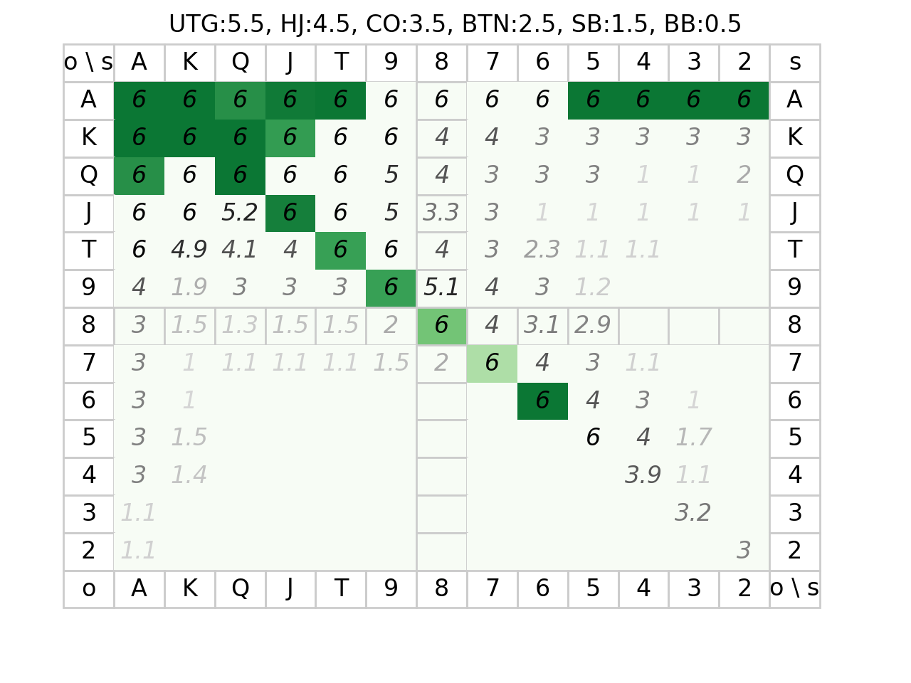

# ハンドレンジ
- SBで1レンジを使用するなら色付き以外コールから入る
- BBでは相手と同じ立場ならコールで入る
- 薄い色：レイズした相手の色にはコールで入る。
- 最緑：オールイン覚悟のリレイズで入る.

- +2枚でフラッシュ(`♥♥♥♥x`): 35%
- +2枚でストレート(`3456`): 32%
- +2枚でストレート(`34 67`): 17%
- レイズ
  - 最緑：相手のレイズでもブラフなら全てリレイズで返す
  - 相手からのレイズには真値で期待値で返す。相手へのレイズは嘘値OK
  - ツーヒット / スリーカード: オールイン覚悟で Botx1
  - ポケット+low3 / ヒット+河がlow3: オールイン覚悟で Botx1

# その他
- ポケット+5枚でスリーカード: 20%
- スーテッド+5枚でフラッシュ: 6.4%
- スーテッドコネクタ+5枚でストレート: 3% ~ 8.6%
- 任意の5枚がノーペア: 50%
- 任意の5枚がワンペア: 42%
- アウツ*2%。2回なら約2倍未満。
- http://hyahhoopoker.com/others/odds
