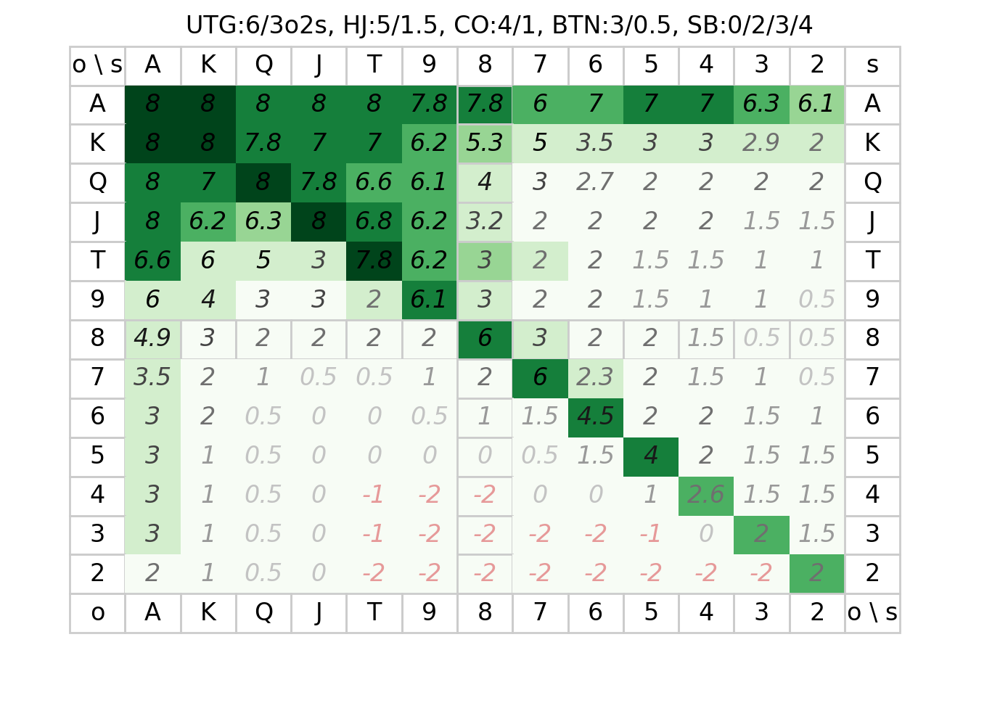

# ハンドレンジ
- 50BB: +1.0, 40BB: +0.5, 30BB: +0, 20BB: -0.5, 10BB: -1
- 6人: +0, 5人: +0.5, 4人: +1, 3人: +1.5
- 以降のショートスタック人数: 1人: +0.5, 2人: +1, 3人: +1.5

- コール/リレイズ: 相手のBBが自分のBBx0.75~1 なら 色+1
- コール/リレイズ: 相手のBBがそれより少なめなら最濃+7.5 のみ
- raised @ SB: BBを降ろすために,薄緑の最大時はリレイズに切り替え
- raised @ BB: 3s-2o / 1.5 / 1 / 0.5 / 2 ならコール
- 1vs1: SBは不利なので、領域0以外はレイズ
  - BBは, 3あればリレイズ, 2だとコール
  - SBは更に, 4あればリレイズ, 3だとコール
- 最緑：リレイズで入る.
- 薄緑：レイズにコールで入る。薄い色は相手のポジションが弱ければ。
- 10BB以下のオールイン：相手の席より大きいならオールイン。ほかはオリ

# フロップ後

- +2枚でフラッシュ(`♥♥♥♥x`): 35% (Pod x1以下までOK)
- +2枚でストレート(`3456`): 32% (Pod x1以下までOK)
- +2枚でストレート(`34 67`): 17% (Pod x0.25以下までOK)
- ポケット+5枚でスリーカード: 20%
- スーテッド+5枚でフラッシュ: 6.4%
- スーテッドコネクタ+5枚でストレート: 3% ~ 8.6%
- 任意の5枚がノーペア: 50%
- 任意の5枚がワンペア: 42%
- ナッツ構成カードを持っているならばブラフされる/ブラフできる可能性が高い。「K♣︎Q♠︎7♠︎4♠︎3❤︎」に 「A♠︎T♣︎」など。
- アウツ*2%。2回なら約2倍未満。
- http://hyahhoopoker.com/others/odds

## 所持率

## 勝率

# ポーカーチェイスでの期待値最大化
- アンティがある分ルーズに行く必要があるが、点数がタイト、について
- 1BBが移動する分には差はほぼない
- 違いの正体は、XBBで戦うと両者が約0.05X点を失う点(観戦者に支払う)
  - 加えて場の均衡が崩れれば崩れるほど係数が大きくなる。
  - 負けてる時の戦略: 均衡が崩れないように、負けてる同士で戦わない. 勝ってる相手を狙う
    - 直感的には、負けているもう一人が死ぬと次に自分が死んでしまう
  - 普通の時の戦略: 勝っている相手と優先して戦う.
    - 負けてる相手に自分が負けた場合にショートスタックが入れ替わってしまうが、
      勝ってる相手に自分が負けた場合はショートスタックの人が他にも居るので動きやすい
  - 勝ってる時の戦略: コール/リレイズされやすくなるので、絞る？
    - アンティー支払いで済ましやすくなっている ?
- 選択肢の違い
  - レイズにコール/リレイズする:
    - 自分より上のBB帯 -> 絞る必要なし
    - 自分と同じBB帯 -> 観戦税があるので少し絞る
    - 自分より下のBB帯 -> 損なので絞る
  - レイズする:
    - 以降に自分より下のBB帯が0 -> 絞る必要なし
    - 以降に自分より下のBB帯が1 & CO以上 -> 観戦税があるので少し絞る
    - else -> コール/リレイズされやすいので絞る
  - レイズにリレイズされる:
    - 既に↑を見越して絞るべきときは絞っているはずなので適切に対応
